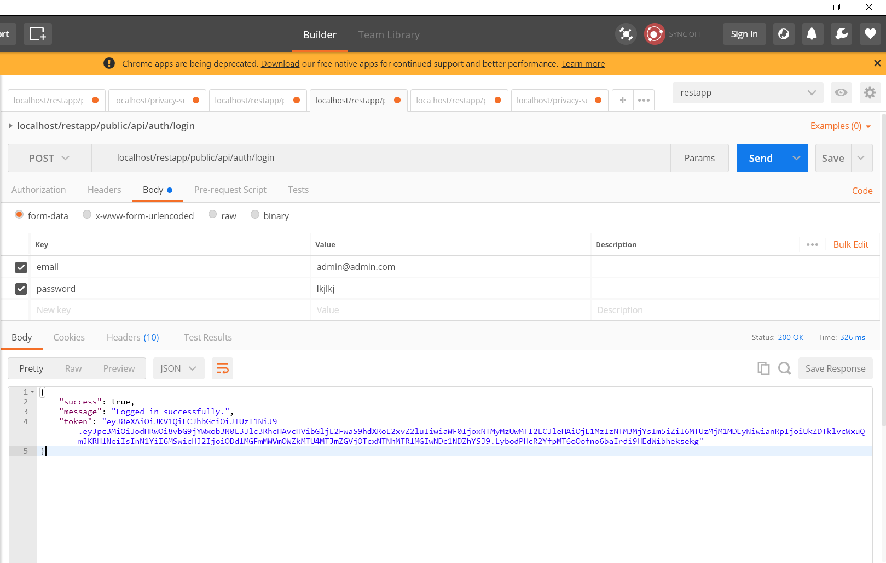
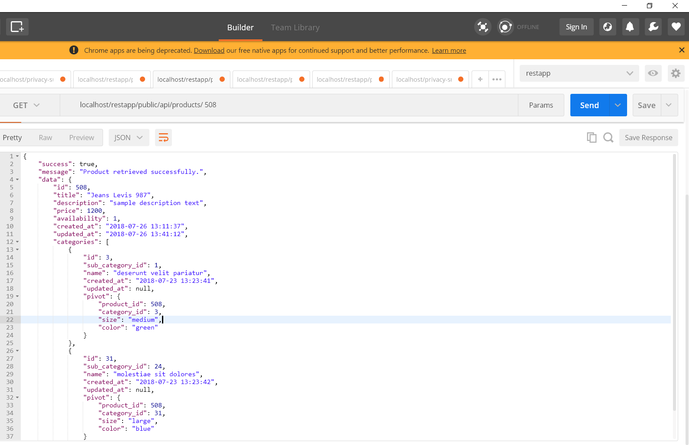
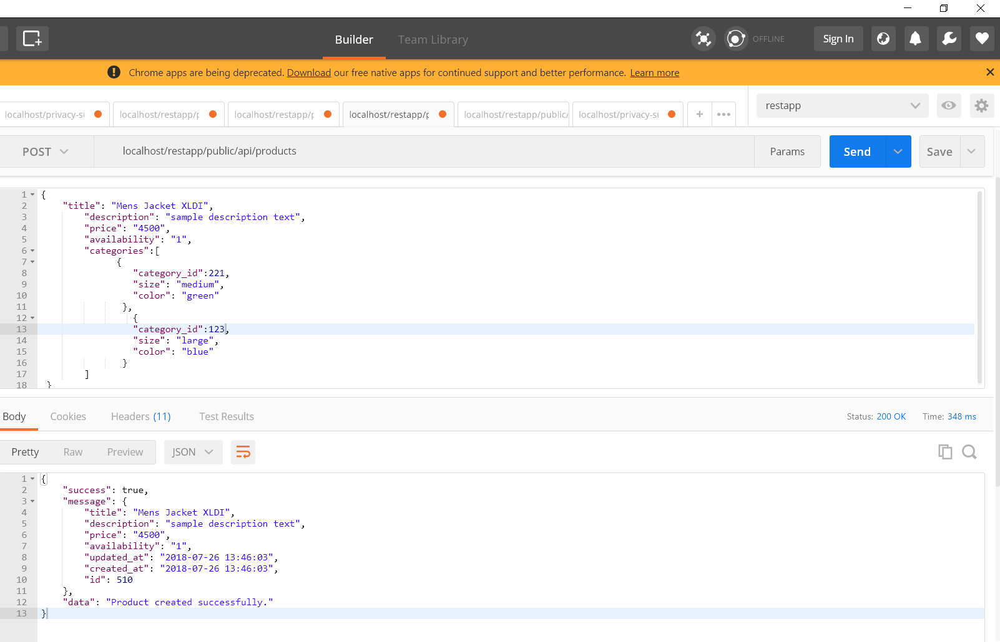
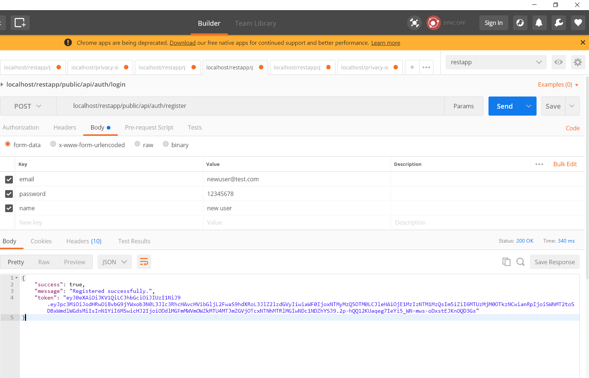

# LaravelRestApp | CodeSample

##About this Laravel Project

This is a REST API developed in Laravel Framework.
The purpose of developing this project is just to show my understanding about the Laravel framework and to provide the sample code for companies/organization if required.
I have tried to follow the best practices to develop this REST API.

I have:
>
> 1. Followed the MVC pattern provided my Laravel Framework
> 2. Implemented the Repository pattern to keep the controllers clean and lean and repositories fat
> 3. Tried to use the Eloquent ORM for all the CRUD operations
> 4. Tried to follow the best practices for developing the REST APIs
>

I am currently learning Angular & in furure I have plans to connect this API with the Angular FronEnd.

## Code Screen Shots

### ProductsController

### ProductRepositoryInterface

### ProductRepository

### ProductModel

## Work Flow of Products API

## POSTMAN API Calls:

### Login Success

### Login Invalid Credentials Error

### Login Validation Errors

### Get All Products

### Products GET by ID

### Products GET by ID Error / Product Not Found

### Save/POST Products Success

### Update/PUT Products Success

### Products Delete 

### Products Delete Error /  Product Not Found

### Register Success

### Token Expired

## LinkedIn Profile Link
 Here's link to my profile on [LinkedIn](https://www.linkedin.com/in/mobeendev) 

Thank you

Regards:

Abdul Mobeen

